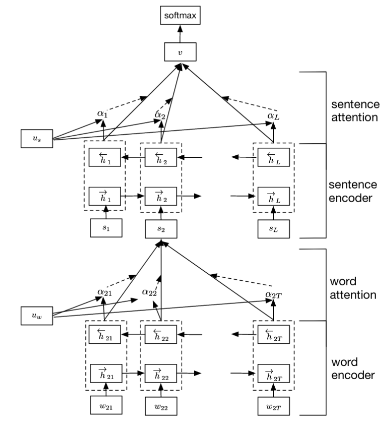
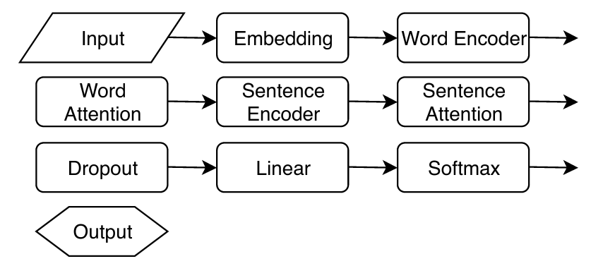

# HAN.py

This python module contains an implementation of a Hierarchical Attention Network (HAN) in PyTorch. You can find details on the model in the following paper:

>Yang, Z., Yang, D., Dyer, C., He, X., Smola, A., & Hovy, E. (2016, June). Hierarchical attention networks for document classification. In Proceedings of the 2016 conference of the North American chapter of the association for computational linguistics: human language technologies (pp. 1480-1489).

The paper can be found [here](https://www.cs.cmu.edu/~./hovy/papers/16HLT-hierarchical-attention-networks.pdf). 
 
The HAN can  retain  some  of  the  hierarchical structure inherent to textual data. The attention mechanism allows us to assign weights to each word based on their importance. Hence, we can pick out the most ’informative’ words of a sentence, as  well  as  the  most  informative  sentences  in  a  document. Therefore,  we  expect  the  model  to  be  somewhat  ’context-aware’. 

The  HAN  consists  of  five  separate  modules (see image below. Image is taken from the paper by Yang et al.). 

</img>

First, we feed the input sequences to a word encoder, which is a bidirectional Gated Recurrent Unit (GRU). Like the LSTM, the GRU is a recurrent neural network  that  allows  us  to  carry  information  across  long sequences  of  input  data.  However,  the  architecture  of  the GRU is simpler than the LSTM and as such is considerably faster. By using a bidirectional GRU, we can use information by scanning the sequence from left to right and vice versa.

We  apply  attention  to  each  of  the  intermittent  hidden states  to  obtain  a  sentence  vector  for  each  sentence.  The sentence vectors are then concatenated together. This serves as  the  input  to  the  sentence  encoder  (also  a  bidirectional GRU). We again apply the attention mechanism. The output of this process is fed to a softmax classifier that predicts the topic of the document. See image below for a schematic overview of the implementation in this module:

</img>

## Installation

Clone this repository, go to the repository in a terminal, and execute:

```shell
pip install .
```

## Example

A GPU version of this example may be found in this [Google Colab notebook](https://colab.research.google.com/drive/1meMEMOTvNv4-CK3NAa793eIYn3GOFhl-?usp=sharing).

This example uses a subset of the [Wikipedia Vital Articles list, level 4](https://github.com/JasperHG90/WikiVitalArticles). It contains three labels. These labels represent top-level categories to which the articles belong.

First, download the dataset on your device:

```shell
wget https://raw.githubusercontent.com/JasperHG90/wikipedia-sample/master/vital_articles_sample.txt
```

Next, load the required libraries and define the settings we will use for the model:

```python
from HAN import train_HAN, HAN, predict_HAN, Vectorizer, segmenter
from torch import optim
import torch
import torch.nn as nn
import numpy as np
import json
from argparse import Namespace

# Define model settings
myhan_settings = Namespace(
    num_tokens=3000,
    embedding_dim=128,
    hidden_dim_word_encoder=32,
    hidden_dim_sentence_encoder=32,
    dropout=0.2,
    learning_rate=0.005,
    validation_split=.1,
    epochs=3,
    batch_size=64,
    device="cpu"
)
```

We can load the dataset as follows:

```python
# Load data
with open("vital_articles_sample.txt", "r") as handle:
    lines = [line.strip("\n").split("\t") for line in handle]

# Texts in list, labels in list
texts = [el[0] for el in lines]
labels = [el[1] for el in lines]

# Unique classes
nclasses = len(np.unique(labels))
```

The HAN.py library contains a `segmenter` function that preprocesses the data such that each input document is split up into sentences. We also ignore punctuation and numbers. Note that this function is not really optimized for speed, but you can write your own segmenter function and use that on larger texts. The library also contains a `Vectorizer` class that can be saved to a file for later use. 

```python
# Segment texts
snippets = segmenter(texts)
# Process input texts
vectorizer = Vectorizer.from_dict(snippets, labels, 
                                  top_n=myhan_settings.num_tokens)
# Save the vectorizer to disk
vectorizer.to_serializable("vectorizer_wiki.json")
# Save snippets
with open("snippets.json", "w") as handle:
    json.dump(snippets, handle)
```

You may load the vectorizer as follows:

```python
# Load vectorizer and snippets
vectorizer = Vectorizer.from_serializable("vectorizer_wiki.json")
with open("snippets.json", "r") as handle:
    snippets = json.load(handle)
```

We can now vectorize the labels and the snippets.

```python

# Vectorize input texts
input_vectorized = [vectorizer.to_sequences(doc) for doc in snippets]

# Vectorize labels
labels_vectorized = vectorizer.map_labels(labels)
```

Note that the snippets are of different lengths. This is not a problem, but you may want to cap your input documents, especially if most of the relevant information appears early on in a document (this is a hyperparameter).

We next set up the HAN, the optimizer and the loss function:

```python
# Set up HAN
myhan = HAN(myhan_settings.num_tokens, myhan_settings.embedding_dim,
            myhan_settings.hidden_dim_word_encoder, myhan_settings.hidden_dim_sentence_encoder, 
            myhan_settings.batch_size, nclasses, myhan_settings.device, myhan_settings.dropout)
# To device
myhan.to(myhan_settings.device)
# Set up optimizer
optimizer = optim.Adam(myhan.parameters(), lr=myhan_settings.learning_rate)
# Loss function
criterion = nn.CrossEntropyLoss()
```

We can train and save the model as follows:

```python
# Call training function
myhan, history = train_HAN(input_vectorized, labels_vectorized, myhan, optimizer, criterion,
                            epochs=myhan_settings.epochs, val_split=myhan_settings.validation_split, 
                            batch_size = myhan_settings.batch_size,device = myhan_settings.device)

# Save the model weights
torch.save(myhan.state_dict(), "myhan.pt")
```

Then, we may load the model by setting up a new HAN object and loading the parameter weights from the file:

```python
# Load the model weights
myhan = HAN(myhan_settings.num_tokens, myhan_settings.embedding_dim,
            myhan_settings.hidden_dim_word_encoder, myhan_settings.hidden_dim_sentence_encoder, 
            myhan_settings.batch_size, nclasses, myhan_settings.device, myhan_settings.dropout)
myhan.load_state_dict(torch.load("myhan.pt", map_location=torch.device(myhan_settings.device)))
```

You can make predictions as follows:

```python
# Predict on new texts
yhat, ytrue = predict_HAN(myhan, input_vectorized, classes_vectorized, myhan_settings.batch_size)

# Get accuracy etc
from sklearn.metrics import classification_report
print(classification_report(ytrue, yhat))
```

## Using pretrained Embeddings

After you initialize the model, you can replace the 'embedding' layer with another embedding layer (such as a pretrained embedding). Let's say that you are using the [FastText embeddings](https://fasttext.cc/docs/en/english-vectors.html). You can download e.g. the 'wiki-news-300d-1M.vec.zip', and use the vectorizer to filter the embedding for those words that occur in your dataset.
